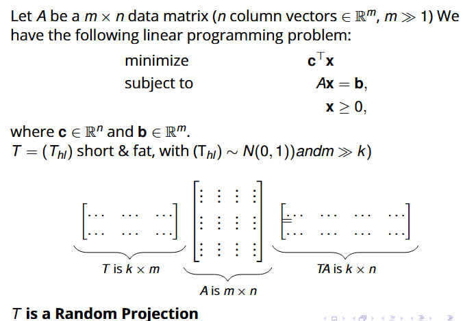
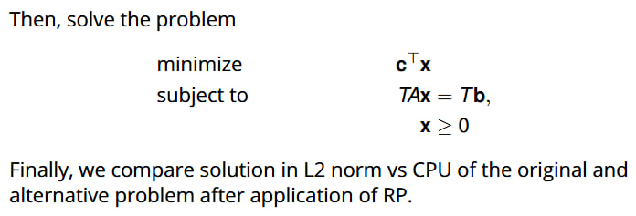

# Random Projection for Linear Programming

## Overview  
This project studies random‐projection methods to reduce constraint dimensions in large LPs and evaluates two recovery algorithms on both feasible and infeasible instance sets. This repository is part of my master thesis "Matrix Sketching and Linear Programming". 

## Model Description





## Experimental Setup

We tested LP instances for various $(m,n)$ pairs and constraint densities $\mathrm{dens}\in\{0.1,0.3,0.5,0.7\}$. For each triplet $(m,n,\mathrm{dens})$:
1. Sampled 10 random $A\in\mathbb R^{m\times n}$ with entries $\sim N[0,1]$, set $c=\mathbf1$.
2. Generated feasible $b=Ax$ and infeasible $b$ via Farkas’ lemma.
3. Solved both original and projected problems using Gaussian, sparse, and orthogonal projectors.


## Features  
- **Feasible Instances**  
  - Generator: `generate_feasible_problems(m, n, num_problems, density)`  
  - Projection: Gaussian random matrices of size \(k \times m\)  
  - Recovery:  
    1. Dual‐based (exact-solve)  
    2. Primal-based (pseudoinverse)  
  - Metrics: original vs. projected CPU time, feasibility error, objective error, negativity

- **Infeasible Instances**  
  - Generator: `generate_infeasible_problems(m, n, num_problems, density)`  
  - Projectors:  
    - Sparse \(\{\pm1,0\}\) random matrix  
    - Orthogonal via QR  
  - Metrics: original vs. projected CPU time, projection/multiplication/solve breakdown, misclassification rate (acc).

In both cases the projected CPU includes sampling $T$, computing the matrix product $TA$, and solving the projected problem. The accuracy metric (`acc`) indicates no misclassification of infeasible instances as feasible.

## Efficiency of Random Projection Methods

### Infeasible Instances

The original infeasible problem may be quickly identified as unsolvable by a HIGHS solver (for instance, if $b \le 0$ and $A \ge 0$), allowing it to terminate early. However, the projected problem often becomes feasible, requiring the solver to compute an optimal solution. This involves multiple iterations on a dense matrix, which is far more time-consuming than handling the sparse original matrix.

### Feasible Instances

- **Gaussian projector**  
  - Reduces dimension by ≈50% (e.g. $n=1400\to k\approx327$).  
  - Projection and solving on the dense $T A$ make total CPU time 3–10× higher than the original as $m,n$ grow.

- **Sparse projector**  
  - Projection and multiplication costs are negligible ($<0.05$ s).  
  - Overall solve time remains within ~1× of the original LP, even for large instances—making it the most efficient.

- **Orthogonal projector**  
  - QR-based projection costs ~0.1–0.3 s; solve time increases by ~1.2–1.5×.  
  - Preserves geometry perfectly but incurs moderate overhead.

**Conclusion:** Sparse random projections offer the best efficiency trade-off: they cut constraint dimensions dramatically with almost no extra compute time while maintaining perfect infeasibility detection.  


## Requirements  
```bash
pip install numpy scipy cvxpy pandas
